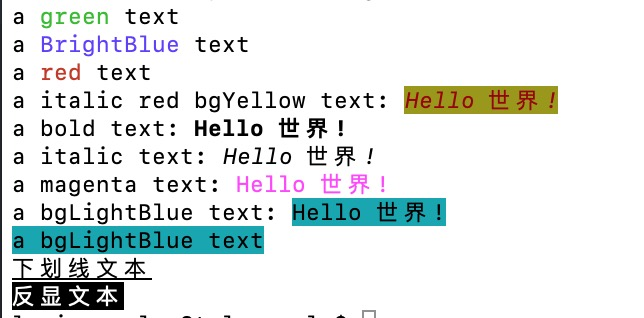

# colorStyle
ColorStyle is a library of styles for command-line text.
Used to modify the style of text for standard output to the terminal interface, you can change the foreground colour of the text, the background colour, add underline and bold, etc.

ColorStyle 是一个用于命令行文本的样式库。
用于标准输出到终端界面的文本的样式修改，可以修改文本前景色，背景色，增加下划线和加粗显等。

# Doc

See this document at [GoDoc](https://pkg.go.dev/github.com/flylog/colorStyle)

# Install
    
    go get -u github.com/flylog/colorstyle@latest


# Example

```
package main

import (
	"fmt"

	"github.com/flylog/colorstyle"
)

func main() {
	text := colorstyle.Green("green")
	fmt.Printf("a %s text\n", text)

	text = colorstyle.BrightBlue("BrightBlue")
	fmt.Printf("a %s text\n", text)

	text = colorstyle.New().ColorRed().Sprint("red")
	fmt.Println("a", text, "text")
	colorstyle.New().StyleItalic().ColorRed().BgYellow().Printf("a italic red bgYellow text: %s\n", "Hello 世界!")
	colorstyle.New().StyleBold().Printf("a bold text: %s\n", "Hello 世界!")
	colorstyle.New().StyleItalic().Printf("a italic text: %s\n", "Hello 世界!")
	colorstyle.New().ColorBrightMagenta().Printf("a magenta text: %s\n", "Hello 世界!")
	colorstyle.New().BgCyan().Printf("a bgCyan text: %s\n", "Hello 世界!")
	colorstyle.New().BgCyan().Println("a bgCyan text")

	css := colorstyle.New()
	css.StyleUnderline().Println("下划线文本")
	css.StyleReverse().Println("反显文本")

}

```
output:


